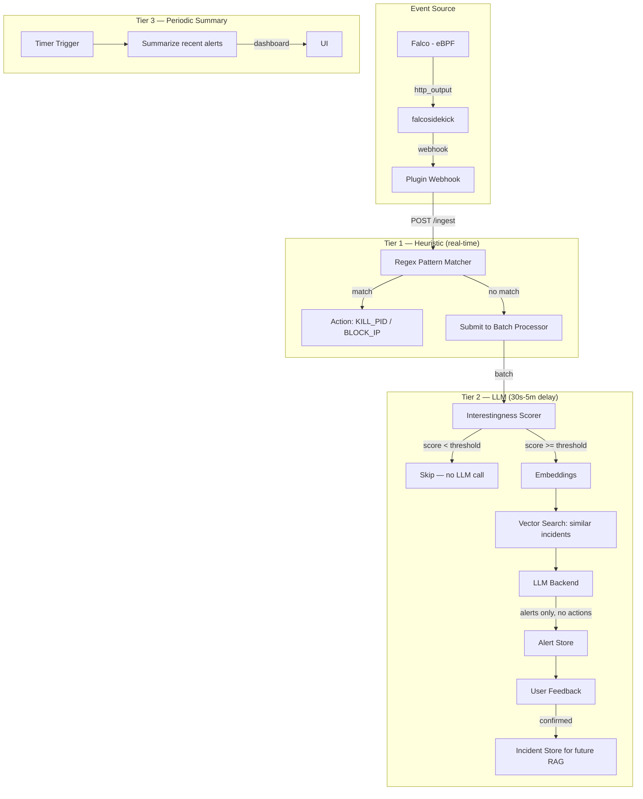
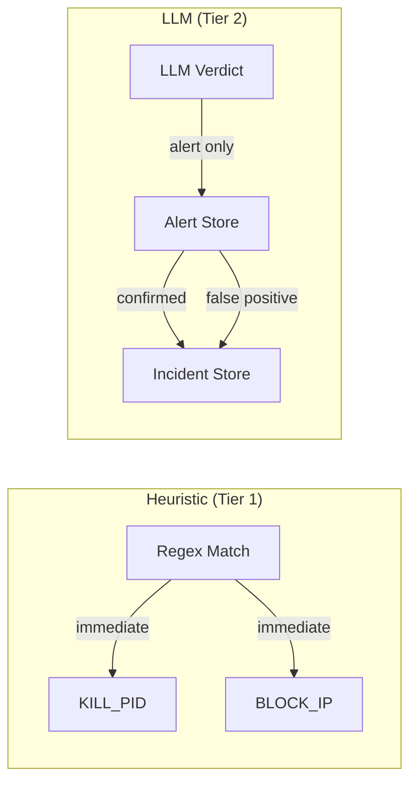
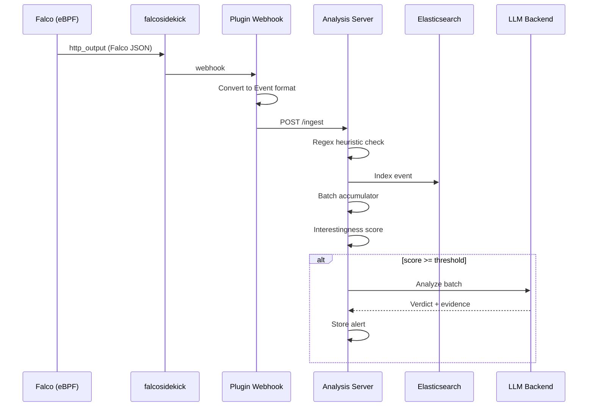

# KernelHarbor

Linux kernel security monitoring — **Falco** + heuristic detection + optional LLM-powered analysis.

**Three-tier architecture:** Heuristic (Tier 1) → LLM analysis (Tier 2) → Periodic summaries (Tier 3)

**Credits:** [Kien Do](https://github.com/kienmarkdo), [Francois Coleongco](https://github.com/fr4nsyz), [John Tyler](https://github.com/john00003), [Mehar Klair](https://github.com/meharklair)

> KernelHarbor originally shipped a custom eBPF agent for kernel event collection. The default
> pipeline now uses **Falco + falcosidekick** for event collection — more robust, no custom
> eBPF compilation needed. The original custom eBPF agents (`cmd/agent/` and friends) are
> preserved in the repo and can still be built via `make agent` for those who prefer them.

## Architecture

### Three-Tier Detection Pipeline



### Response Flow



**Key design decision:** The LLM never generates automatic actions. Only the heuristic engine (regex patterns) can produce `KILL_PID` and `BLOCK_IP`. The LLM produces alerts for human review, plus labeled incidents that improve future RAG.

| Tier | Trigger | Latency | Actions Produced |
|------|---------|---------|-----------------|
| 1 — Heuristic | Regex match | Same HTTP response | `KILL_PID`, `BLOCK_IP` |
| 2 — LLM | Interestingness >= threshold | 30s-5m | Alerts only |
| 3 — Periodic Summary | Timer (configurable) | Hours | Dashboard summaries |

### Event Flow



## Quick Start

### Prerequisites

```bash
# Falco + falcosidekick
# See: https://falco.org/docs/install/
# See: https://github.com/falcosecurity/falcosidekick

# Optional: Elasticsearch for event persistence
docker run -d --name elasticsearch -p 9200:9200 \
  -e "discovery.type=single-node" \
  -e "xpack.security.enabled=false" \
  docker.elastic.co/elasticsearch/elasticsearch:8.17.4

# Optional: Ollama for local LLM
ollama serve
ollama pull nomic-embed-text
ollama pull qwen2.5:7b
```

### Build

```bash
make            # Build analysis service
make analysis   # Build analysis only
make agent      # Build legacy custom eBPF agent (optional, not needed for Falco)
make clean      # Remove binaries + generated files
```

### Run

```bash
# Terminal 1: Analysis service (heuristic-only by default, zero external deps)
cd cmd/analysis && ./analysis

# Terminal 2: Falco + falcosidekick (requires sudo for Falco)
sudo falco -r rules/kernelharbor-rules.yaml \
  -o json_output=true \
  -o http_output.enabled=true \
  -o http_output.url=http://localhost:2801/
falcosidekick

# Or via the OpenClaw plugin (recommended): see kernelharbor-openclaw/
```

### Run with LLM (Optional)

```bash
# Start analysis with Ollama backend
LLM_BACKEND=ollama cd cmd/analysis && ./analysis

# Or with OpenAI
LLM_BACKEND=openai OPENAI_API_KEY=sk-... cd cmd/analysis && ./analysis
```

## Components

| Component | Directory | Description |
|-----------|-----------|-------------|
| Analysis | `cmd/analysis/` | Event analysis pipeline — heuristic + optional LLM |
| OpenClaw Plugin | `kernelharbor-openclaw/` | Orchestrates Falco + falcosidekick + analysis |
| Falco Rules | `kernelharbor-openclaw/rules/` | Detection rules for Falco |
| Legacy Agent | `cmd/agent/` | Original custom eBPF tracer (optional, not needed for Falco) |

### Analysis Component Internals

| Package | Path | Purpose |
|---------|------|---------|
| `interestingness` | `cmd/analysis/internal/interestingness/` | Scores event batches (0.0-1.0) for LLM gating |
| `llm` | `cmd/analysis/internal/llm/` | LLM backends: ollama, openai, anthropic, null |
| `incidents` | `cmd/analysis/internal/incidents/` | Labeled incident store with cosine similarity search |
| Alerts | `cmd/analysis/alert.go` | Alert storage with feedback mechanism |
| Processor | `cmd/analysis/processor.go` | Batch accumulator, interestingness scorer, LLM pipeline |

## API Endpoints

| Endpoint | Method | Description |
|----------|--------|-------------|
| `/health` | GET | Health check |
| `/ready` | GET | Readiness check (Elasticsearch, LLM status) |
| `/ingest` | POST | Ingest events (single or array) |
| `/ingest/batch` | POST | Ingest batched events |
| `/analyze` | POST | On-demand LLM analysis of a query string |
| `/actions/:hostname` | GET | Fetch pending heuristic actions for a host |
| `/api/alerts` | GET | List alerts (query: `since`, `min_verdict`, `limit`) |
| `/api/alerts/stats` | GET | Alert statistics (24h count, verdict breakdown, feedback) |
| `/api/alerts/:id/feedback` | POST | Submit feedback (`confirmed` or `false_positive`) |
| `/api/incidents` | GET | List labeled incidents |

### Alert Feedback

```bash
curl -X POST http://localhost:8080/api/alerts/<alert-id>/feedback \
  -H "Content-Type: application/json" \
  -d '{"feedback": "confirmed"}'
```

Confirmed alerts become labeled incidents in the RAG store, improving future analysis.

## Interestingness Gating

The interestingness scorer gates LLM analysis — only batches scoring above `LLM_THRESHOLD` (default 0.6) trigger LLM calls. This eliminates ~95% of unnecessary LLM invocations.

Scoring factors:
- Exec + network events in the same batch (+0.3)
- Download followed by network connection (+0.2)
- Network tool usage (+0.2)
- Temp directory execution (+0.3)
- Connections to mining/c2 ports (+0.25)
- Near-miss patterns (+0.15 each, max +0.45)
- Unknown binary execution (+0.15)
- Rapid unique port connections (+0.15)

The `null` backend (default) means zero external dependencies in production. Set `LLM_BACKEND=none` to run without LLM.

## Environment Variables

### Analysis Service

| Variable | Default | Description |
|----------|---------|-------------|
| `LLM_BACKEND` | `none` | LLM backend: `none`, `ollama`, `openai`, `anthropic` |
| `LLM_THRESHOLD` | `0.6` | Minimum interestingness score to invoke LLM (0.0-1.0) |
| `OLLAMA_ADDRESS` | `http://localhost:11434` | Ollama server address |
| `OLLAMA_MODEL` | `qwen2.5:7b` | Ollama analysis model |
| `ES_ADDRESSES` | `http://localhost:9200` | Elasticsearch addresses |
| `ES_INDEX` | `kb-events` | Elasticsearch events index |
| `OPENAI_API_KEY` | — | OpenAI API key |
| `OPENAI_MODEL` | `gpt-4o-mini` | OpenAI model |
| `ANTHROPIC_API_KEY` | — | Anthropic API key |
| `ANTHROPIC_MODEL` | `claude-3-haiku-20240307` | Anthropic model |
| `PROTOCOL` | `both` | Server protocol: `http`, `grpc`, or `both` |
| `GRPC_ADDRESS` | `:9090` | gRPC server address |
| `HTTP_ADDRESS` | `:8080` | HTTP server address |

## Project Structure

```
KernelHarbor/
├── bpf/                       # eBPF C programs (for reference, not built by default)
├── cmd/
│   ├── agent/                 # Legacy custom eBPF agent (optional)
│   ├── execve-tracer/         # Legacy standalone tracer (optional)
│   ├── open-tracer/           # Legacy standalone tracer (optional)
│   ├── openat-tracer/         # Legacy standalone tracer (optional)
│   └── analysis/              # Analysis pipeline
│       ├── main.go            # Entry point, config, server startup
│       ├── routes.go          # HTTP route handlers
│       ├── processor.go       # Batch processor + LLM pipeline
│       ├── alert.go           # Alert store with feedback
│       ├── event.go           # Event types + behavior summaries
│       ├── grpc.go            # gRPC handlers + heuristic patterns
│       ├── elastic.go         # Elasticsearch client
│       ├── state.go           # Package-level state
│       ├── bench_test.go      # Benchmarks + accuracy tests
│       ├── eval_test.go       # Evaluation framework
│       └── internal/
│           ├── interestingness/  # Batch scoring
│           ├── llm/              # LLM backends
│           └── incidents/        # Labeled incident store
├── proto/                     # Protocol Buffer definitions
├── kernelharbor-openclaw/     # OpenClaw plugin (Falco-based event collection)
├── deploy/                    # Docker Compose + Dockerfiles
├── scripts/                   # Utility scripts
├── Makefile
└── README.md
```

## Tests

```bash
# All unit tests
go test ./cmd/analysis/...

# Evaluation tests (no external services needed)
go test -run 'TestEval' ./cmd/analysis/...

# Benchmarks
./scripts/bench.sh

# Full test suite (requires Elasticsearch + Ollama)
ES_ADDRESSES=http://localhost:9200 OLLAMA_ADDRESS=http://localhost:11434 \
  go test -bench='Benchmark(ES|Ollama)' ./cmd/analysis/...
```

## Deployment

### Docker (AI Mode)

```bash
cd deploy
docker compose up -d
```

This starts Elasticsearch, Ollama, and the analysis service. For event collection, run
Falco natively (requires eBPF + root) or use the OpenClaw plugin.

### Heuristic-Only (Production)

No external dependencies — just the analysis binary:

```bash
cd cmd/analysis && go build -o analysis . && ./analysis
# Events received via HTTP :8080 from Falco + falcosidekick or the OpenClaw plugin
```

## Legacy Custom eBPF Agent

KernelHarbor originally shipped a custom eBPF agent. It's still available if you prefer
not to use Falco:

```bash
# Build requirements: clang, llvm, libbpf-dev, kernel headers
sudo apt install clang llvm libbpf-dev linux-tools-$(uname -r)  # Debian/Ubuntu

# Build
make agent

# Run (requires sudo)
sudo GRPC_ADDRESS=localhost:9090 ./cmd/agent/agent
```

The custom agent sends events via gRPC directly to the analysis service. This path
receives less maintenance but is preserved for compatibility.

## License

MIT
