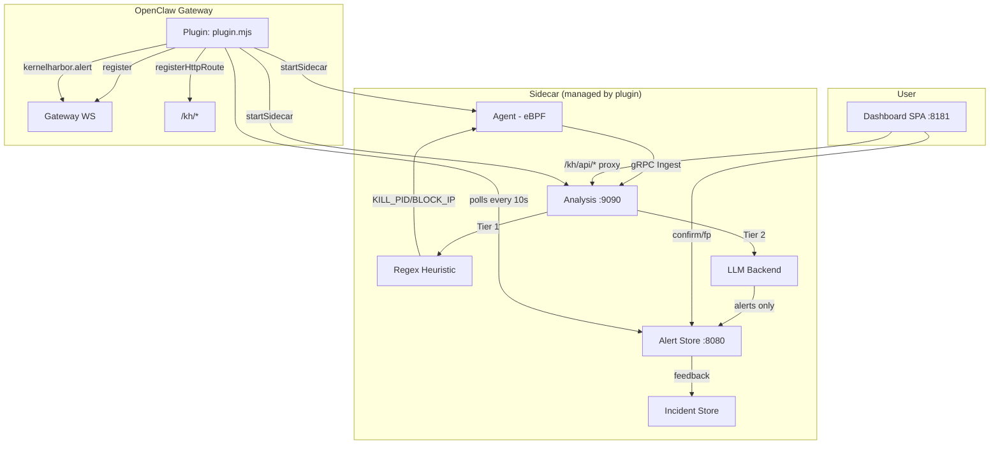
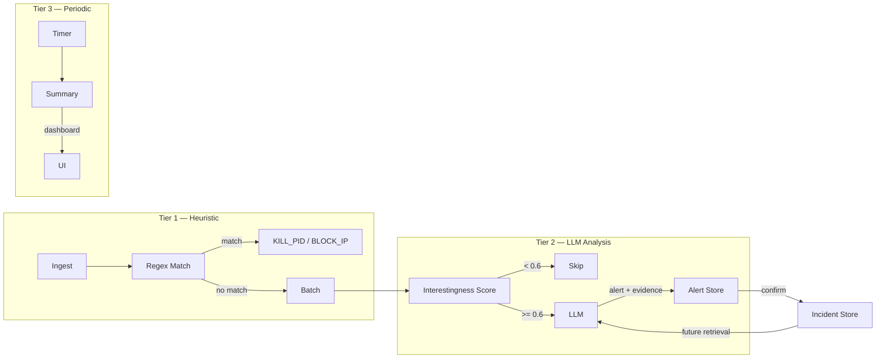
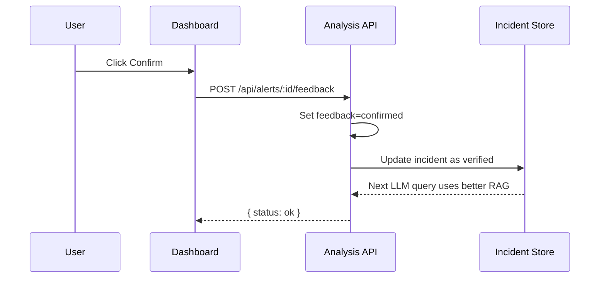

# KernelHarbor — OpenClaw Extension

Linux kernel security monitoring for [OpenClaw](https://openclose.ai) Gateway —
eBPF tracing, heuristic detection, and optional LLM-powered analysis.

## Features

- **Real-time kernel monitoring** via eBPF (execve, open, openat, connect)
- **Three-tier detection**: heuristic (real-time) → LLM (delayed) → summaries
- **Automatic actions**: KILL_PID, BLOCK_IP via regex heuristics — zero LLM latency
- **Optional LLM analysis**: Ollama, OpenAI, or Anthropic — gated by interestingness scoring
- **Dashboard SPA**: view alerts, stats, submit feedback
- **Feedback loop**: confirmed alerts become RAG incidents for better future analysis
- **OpenClaw integrated**: gateway methods, HTTP routes, sidecar lifecycle management

## Architecture



## Installation

### From OpenClaw Marketplace

1. Open OpenClaw Gateway admin
2. Browse Extensions → install KernelHarbor
3. Configure settings (optional)
4. The sidecar starts automatically

### Manual

```bash
# Clone and install
git clone https://github.com/fr4nsyz/KernelHarbor.git
cd KernelHarbor/kernelharbor-openclaw
npm install

# Build binaries
./cli/setup.mjs

# Start dashboard
./cli/dashboard.mjs

# Check status
./cli/status.mjs
```

### OpenClaw Plugin Path

```bash
# Link to OpenClaw plugins directory
ln -s $(pwd) /path/to/openclaw/plugins/kernelharbor-openclaw
```

## Plugin API

### Gateway Methods

| Method | Params | Returns |
|--------|--------|---------|
| `kernelharbor.status` | — | `{ sidecarRunning, alertCount, recentAlerts }` |
| `kernelharbor.alert.feedback` | `{ alertId, feedback }` | `{ status }` |

### Pushed Events

| Event | Payload | When |
|-------|---------|------|
| `kernelharbor.alert` | `Alert` | Every 10s poll |

### HTTP Routes

| Route | Proxy To |
|-------|----------|
| `/kh/dashboard` | Serves `dashboard/index.html` |
| `/kh/api/*` | `http://localhost:8080/api/*` |

### Services

| ID | Description |
|----|-------------|
| `kernelharbor.sidecar` | Manages agent + analysis binary lifecycle |
| `kernelharbor.alert-poller` | Polls alerts from analysis, pushes to gateway |

## Configuration

Configure via OpenClaw Gateway plugin settings:

```json
{
  "analysisAddr": "localhost:9090",
  "dashboardPort": 8181,
  "autoStart": true,
  "binaryDir": ""
}
```

### Environment Variables

| Variable | Default | Description |
|----------|---------|-------------|
| `KH_LLM_BACKEND` | `none` | LLM backend: `none`, `ollama`, `openai`, `anthropic` |
| `KH_DASHBOARD_PORT` | `8181` | Dashboard server port |
| `KH_REPO` | `https://github.com/fr4nsyz/KernelHarbor.git` | Repo for `kh-setup` |

## Three-Tier Detection



## Commands

```bash
kh-setup      # Clone + build KernelHarbor binaries
kh-status     # Print service status and alert summary
kh-dashboard  # Start dashboard on :8181
```

## Dashboard

Start the dashboard and open http://localhost:8181:

```bash
kh-dashboard
```

The dashboard shows:
- **24h stats**: total alerts, malicious, suspicious, confirmed, false positives
- **Alert list**: filter by verdict, time range, limit — with confirm/false-positive buttons
- **Auto-refresh**: every 15 seconds

## Feedback Loop

Every alert has Confirm / False Positive buttons. Confirmed alerts become labeled incidents
in the RAG incident store, improving future LLM analysis via similarity search.



## Development

```bash
# Plugin entry
plugin.mjs

# CLI tools
cli/setup.mjs
cli/status.mjs
cli/dashboard.mjs

# Dashboard SPA
dashboard/index.html
dashboard/app.js
dashboard/style.css

# Detection rules (Falco-compatible)
rules/kernelharbor-rules.yaml

# OpenClaw skill definition
skill/SECURE.SKILL.md
```

## Requirements

- Linux kernel 5.4+ (eBPF)
- OpenClaw Gateway >= 2026.3.24-beta.2
- Go 1.25+ (for building from source)
- clang + llvm + libbpf-dev (for eBPF)
- root/sudo for agent

## License

MIT
