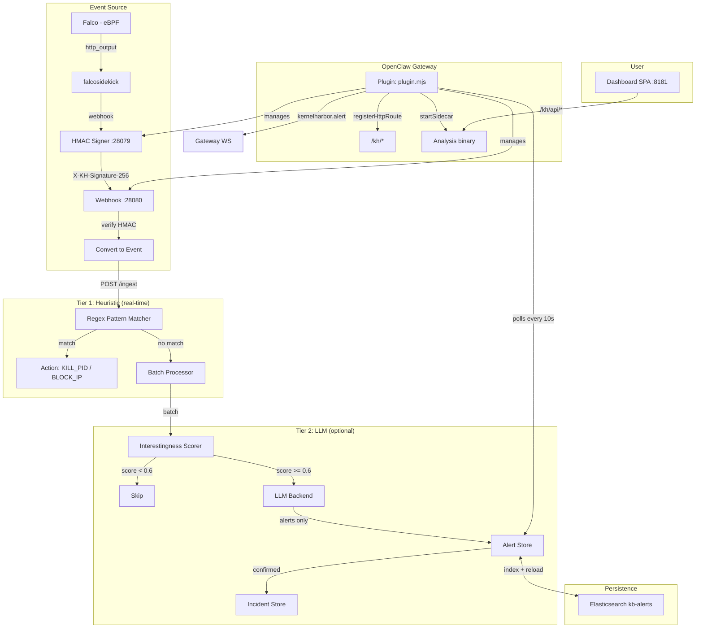
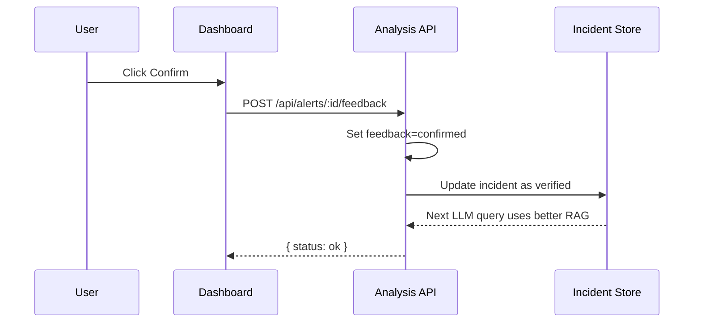

# KernelHarbor OpenClaw Extension

Linux kernel security monitoring for [OpenClaw](https://openclose.ai) Gateway:
Falco-based event collection, heuristic detection, HMAC-signed pipeline, and optional LLM-powered analysis.

## Architecture

```
Falco (eBPF) → falcosidekick → signer:28079 (HMAC-SHA256) → webhook:28080 (verify) → analysis :8080
```



When `KH_SIGNING_SECRET` is empty, HMAC is disabled and the pipeline falls back to
direct `falcosidekick → webhook` (backward compatible).

## Quick Demo

### Standalone

```bash
./demo.sh
```

Starts Elasticsearch (Docker), Ollama, analysis service, sends 5 demo events (benign, suspicious, malicious, crypto mining, data exfil), prints stats, and opens the dashboard. Press Ctrl+C to stop all services.

```bash
USE_LLM=0 ./demo.sh    # heuristic-only, no Ollama needed
USE_ES=0  ./demo.sh    # no Elasticsearch, in-memory only
```

### Full Docker Stack (OpenClaw gateway + HMAC + Falco)

```bash
./demo.sh --docker
```

Builds + starts the complete pipeline in Docker: ES + analysis + OpenClaw gateway (signer + webhook + dashboard) + Falco + falcosidekick. Falco monitors real kernel events and events flow through the signed HMAC pipeline.

```bash
KH_SIGNING_SECRET=my-secret ./demo.sh --docker   # custom HMAC secret
KH_LLM_BACKEND=ollama            ./demo.sh --docker   # with LLM
```

## Installation

### One-Liner (recommended)

```bash
curl -fsSL https://raw.githubusercontent.com/fr4nsyz/KernelHarbor/main/kernelharbor-openclaw/install.sh | bash
```

Installs Go, Falco, falcosidekick (with graceful skipping if sudo unavailable), clones the repo,
runs `npm install` and `setup.mjs`.

```bash
cd ~/kernelharbor/kernelharbor-openclaw
./cli/status.mjs       # check status
./cli/dashboard.mjs    # open browser dashboard
```

### Manual

```bash
git clone https://github.com/fr4nsyz/KernelHarbor.git
cd KernelHarbor/kernelharbor-openclaw
npm install
node ./cli/setup.mjs
```

### OpenClaw Plugin Path

```bash
ln -s $(pwd) /path/to/openclaw/plugins/kernelharbor-openclaw
```

### Docker Compose

```bash
# Full stack (ES + analysis + gateway + signer + Falco + falcosidekick):
KH_SIGNING_SECRET=kh-demo-secret docker compose up -d

# Or use the demo script:
./demo.sh --docker

# With LLM (Ollama):
docker compose --profile llm up -d

# Minimal (ES + analysis only):
docker compose up -d elasticsearch analysis
```

The gateway container runs `gateway.mjs` which simulates the OpenClaw Gateway API,
loads `plugin.mjs`, and manages the HMAC signer + webhook + dashboard. Falcosidekick
is wired to forward events through the signer at `gateway:28079`.

## Plugin API

### Gateway Methods

| Method | Params | Returns |
|--------|--------|---------|
| `kernelharbor.status` | | `{ sidecarRunning, alertCount, recentAlerts }` |
| `kernelharbor.alert.feedback` | `{ alertId, feedback }` | `{ status }` |

### Pushed Events

| Event | Payload | When |
|-------|---------|------|
| `kernelharbor.alert` | `Alert` | Every 10s poll |

### HTTP Routes

| Route | Proxy To |
|-------|----------|
| `/kh/dashboard` | Serves `dashboard/index.html` |
| `/kh/api/*` | `http://localhost:8080/api/*` |

### Services

| ID | Description |
|----|-------------|
| `kernelharbor.sidecar` | Manages analysis binary, signer, and falcosidekick lifecycle with auto-restart and exponential backoff |

## Configuration

### Plugin Config (openclaw.plugin.json)

```json
{
  "analysisAddr": "localhost:9090",
  "dashboardPort": 8181,
  "autoStart": true,
  "falcoRulesPath": "",
  "falcoConfigPath": "",
  "falcoSidekickPort": 2801,
  "falcoWebhookPort": 28080,
  "signerPort": 28079,
  "signingSecret": ""
}
```

| Field | Default | Description |
|-------|---------|-------------|
| `analysisAddr` | `localhost:9090` | gRPC address for the analysis service |
| `dashboardPort` | `8181` | Dashboard SPA port |
| `autoStart` | `true` | Auto-start sidecar processes on gateway startup |
| `falcoRulesPath` | `""` | Path to Falco rules (default: `rules/kernelharbor-rules.yaml`) |
| `falcoConfigPath` | `""` | Path to Falco configuration file (optional) |
| `falcoSidekickPort` | `2801` | Port for falcosidekick to receive events from Falco |
| `falcoWebhookPort` | `28080` | Port for the webhook receiver |
| `signerPort` | `28079` | Port for the HMAC signing proxy |
| `signingSecret` | `""` | Shared secret for HMAC-SHA256 (empty = disabled) |

### Environment Variables

| Variable | Default | Description |
|----------|---------|-------------|
| `KH_SIGNING_SECRET` | `` | HMAC secret for pipeline signing (empty = disabled) |
| `KH_API_KEY` | `` | API key auth for analysis HTTP endpoints (empty = disabled) |
| `KH_DASHBOARD_PORT` | `8181` | Dashboard server port |
| `KH_REPO` | `https://github.com/fr4nsyz/KernelHarbor.git` | Repo for `setup.mjs` |
| `LLM_BACKEND` | `none` | LLM backend: `none`, `ollama`, `openai`, `anthropic` |
| `ES_ADDRESSES` | `http://localhost:9200` | Elasticsearch addresses |
| `OLLAMA_ADDRESS` | `http://localhost:11434` | Ollama server address |
| `OLLAMA_MODEL` | `qwen2.5:7b` | Ollama analysis model |

## Security

### HMAC-SHA256 Pipeline Signing

When `KH_SIGNING_SECRET` (or `signingSecret` config) is set:

- `signer.mjs` runs as a proxy between falcosidekick and the webhook
- Computes HMAC-SHA256 of the raw request body, sets `X-KH-Signature-256` header
- The webhook in `plugin.mjs` verifies the signature using `timingSafeEqual`
- Requests without a valid signature are rejected with 401

### API Key Auth

When `KH_API_KEY` is set on the analysis service, all endpoints except `/health` and `/ready`
require an `X-API-Key` header matching the configured key.

## Data Persistence

Alerts are indexed to Elasticsearch (`kb-alerts` index) on creation. On startup, the
analysis service reloads alerts from the last 72 hours via `LoadAlerts()`. The in-memory
`AlertStore` caps at 10,000 entries (trims to 5,000 when exceeded).

## Reliability

- **Auto-restart**: Crashed subprocesses (Falco, falcosidekick, signer, analysis) are
  automatically restarted with exponential backoff
- **Retry queue**: Failed event POSTs to analysis are retried up to 5 times with 1s backoff
- **Graceful degradation**: `install.sh` skips optional components (Falco, falcosidekick)
  when sudo is unavailable instead of failing

## Dashboard

```bash
./cli/dashboard.mjs
```

Open http://localhost:8181. The dashboard shows:

- **24h stats**: total alerts, malicious, suspicious, confirmed, false positives
- **Severity filter pills**: All / Malicious / Suspicious / Benign
- **Timeline / Cards view toggle**
- **Alert list**: with confirm / false-positive feedback buttons
- **Auto-refresh**: every 15 seconds

## Feedback Loop

Confirmed alerts become labeled incidents in the RAG incident store, improving future
LLM analysis via similarity search.



## Tests

```bash
# E2E tests (49/49): analysis API, dashboard, plugin structure
node test/e2e.mjs

# Smoke tests (8/8): Falco webhook → analysis pipeline
node test/smoke.mjs

# HMAC tests (8/8): signer → webhook verification, reject invalid signatures
node test/e2e-hmac.mjs

# Go unit tests
cd ../cmd/analysis && go test -count=1 -timeout 120s ./...
```

## File Structure

```
kernelharbor-openclaw/
├── plugin.mjs              # Plugin entry: subprocess orchestration, webhook, HMAC verification
├── signer.mjs              # HMAC-SHA256 signing proxy
├── gateway.mjs             # Mock OpenClaw gateway (loads plugin, runs signer + webhook + dashboard)
├── openclaw.plugin.json    # Plugin manifest + config schema
├── install.sh              # One-liner install script
├── demo.sh                 # Quick standalone demo script
├── docker-compose.yml      # Compose: ES, analysis, Falco, falcosidekick, Ollama
├── package.json
├── bin/                    # Compiled analysis binary (built by setup.mjs)
├── cli/
│   ├── setup.mjs           # Clone + build KernelHarbor binaries
│   ├── status.mjs          # Print service status and alert summary
│   └── dashboard.mjs       # Start dashboard on :8181
├── dashboard/
│   ├── index.html
│   ├── app.js
│   └── style.css
├── rules/
│   └── kernelharbor-rules.yaml  # Falco detection rules
├── test/
│   ├── e2e.mjs             # Full E2E test suite
│   ├── smoke.mjs           # Pipeline smoke test
│   └── e2e-hmac.mjs        # HMAC pipeline test
└── skill/
    └── SECURE.SKILL.md     # OpenClaw skill definition
```

## Requirements

- Node.js 22+
- Go 1.25+ (for building from source)
- Falco + falcosidekick (for event collection; optional in Docker Compose)
- Elasticsearch 8.x (for alert persistence; optional, falls back to in-memory)
- Ollama (for LLM analysis; optional, `LLM_BACKEND=none` by default)

## License

MIT
