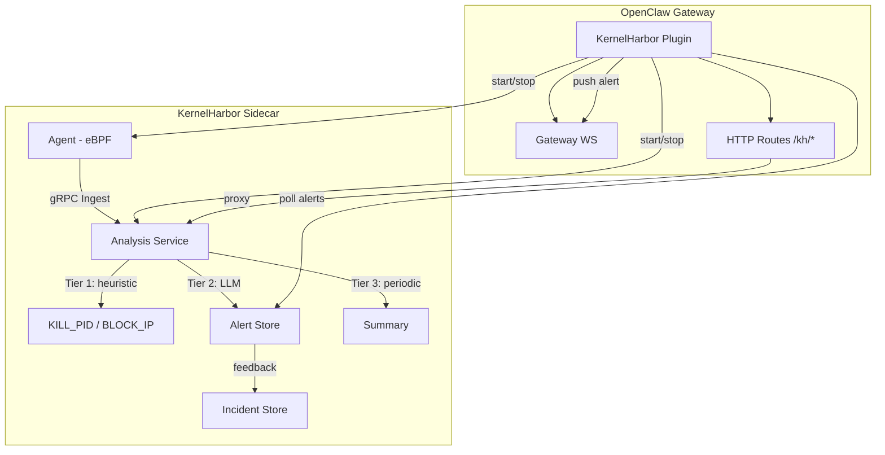

# KernelHarbor Security Skill

## Description

Kernel-level security monitoring powered by eBPF. Tracks process execution (execve), file
operations (open/openat), and network connections (connect). Uses a three-tier detection
pipeline: real-time heuristic rules ↔ delayed LLM analysis ↔ periodic summaries.

**Tier 1 — Heuristic (real-time):** Regex-based pattern matching against the same event stream.
Produces KILL_PID and BLOCK_IP actions returned in-band via the Ingest RPC response.
Zero external dependencies, sub-millisecond latency.

**Tier 2 — LLM (30s–5m delay):** Batched events scored by interestingness. Only batches above
threshold (default 0.6) invoke the LLM. The LLM never produces automatic actions — only alerts
for human review plus labeled incidents for future RAG retrieval.

**Tier 3 — Periodic Summary:** Configurable timer aggregates recent alerts into dashboard summaries.

## How to Use

### Prerequisites

- Linux with kernel 5.4+ (for eBPF)
- clang + llvm + libbpf-dev (for eBPF compilation)
- OpenClaw Gateway with API >= 2026.3.24-beta.2

### Installation

```bash
# From the extension directory
npm install
./cli/setup.mjs
```

Or install from the OpenClaw marketplace.

### Starting

The plugin auto-starts the KernelHarbor sidecar (agent + analysis) on gateway startup.
Configure via plugin settings:

```json
{
  "analysisAddr": "localhost:9090",
  "dashboardPort": 8181,
  "autoStart": true,
  "binaryDir": ""
}
```

### Gateway Methods

| Method | Description |
|--------|-------------|
| `kernelharbor.status` | Returns sidecar running status and recent alerts |
| `kernelharbor.alert` | Pushed when a new alert is generated |
| `kernelharbor.alert.feedback` | Submit feedback (confirmed/false_positive) for an alert |

### HTTP Routes

- `GET /kh/dashboard` — KernelHarbor dashboard SPA
- `GET /kh/api/*` — Proxied to KernelHarbor HTTP API

### Commands

| Command | Description |
|---------|-------------|
| `kh-setup` | Clone + build KernelHarbor binaries |
| `kh-status` | Print service status and alert summary |
| `kh-dashboard` | Start the dashboard SPA server on :8181 |

### Enabling LLM Analysis

Set the `KH_LLM_BACKEND` environment variable before starting the gateway:

```bash
# Ollama (local)
KH_LLM_BACKEND=ollama OLLAMA_ADDRESS=http://localhost:11434

# OpenAI
KH_LLM_BACKEND=openai OPENAI_API_KEY=sk-...

# Anthropic
KH_LLM_BACKEND=anthropic ANTHROPIC_API_KEY=sk-ant-...
```

## What It Detects

| Signature | Type | Tier |
|-----------|------|------|
| Reverse shell (bash -i, /dev/tcp) | Heuristic | 1 |
| Curl/wget piped to shell | Heuristic | 1 |
| Network tool execution (nc, ncat, socat) | Heuristic | 1 |
| Base64 decode | Heuristic | 1 |
| PowerShell / encoded commands | Heuristic | 1 |
| Python socket/subprocess/ptys | Heuristic | 1 |
| Temp directory execution | Heuristic + Interestingness | 1+2 |
| Crypto mining pool connections | Heuristic + Interestingness | 1+2 |
| Unknown binary execution | Interestingness | 2 |
| Near-miss pattern matches | Interestingness | 2 |

## Feedback Loop

Every alert has Confirm/False Positive buttons in the dashboard. Confirmed alerts become
labeled incidents in the RAG store, improving future LLM analysis accuracy.

## Architecture



## Requirements

- Linux kernel 5.4+
- root/sudo access for eBPF
- Go 1.25+ for building
- clang + llvm + libbpf-dev
- OpenClaw Gateway >= 2026.3.24-beta.2
